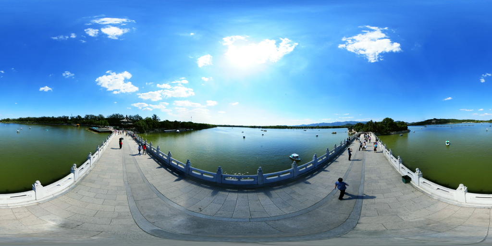
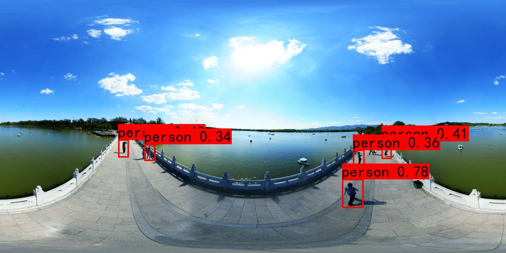
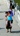
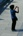
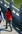
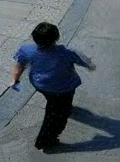
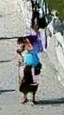
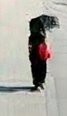
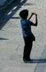
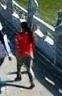

# YOLOv4 and Enhanced SRGAN

### Example of Input Image
<p align="center">
  
</p>

### Example of Detection Image
<p align="center">
  
</p>

### Example of cropped Image
<p align="center">
  
  
  
  
  
</p>

### Example of final Image
<p align="center">
  
  
  
  
  
</p>

## Pretained Models
* YOLOv4:
  [(Download Link)](https://www.dropbox.com/s/8l4va3n1cu6ul8o/yolo4.zip?dl=0)
  
* ESRGAN: 
  [(Download Link)](https://www.dropbox.com/s/va58gkcfo8d0c9d/prdb.zip?dl=0)

## Usage
* YOLOv4 pretrained models in [Yolo_SR/model_data]
* ESRGAN pretrained models in [Yolo_SR/models]
* Object Detection
```
    python3 yolo_test.py
```
* Super-resolution
```
    python3 SR_test.py
```

## References
* [Cropped Detection](https://github.com/GaoZiqiang/crop_objects_based_yolov4_pytorch)
* [ESRGAN](https://github.com/xinntao/ESRGAN)
