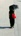

## YOLOv4 and Enhanced SRGAN
### Example of Input Image
<p align="center">
  
</p>

### Example of Detection Image
<p align="center">
  
</p>

### Example of cropped Image
<p align="center">
  
  
  
  
  
</p>

### Example of final Image
<p align="center">
  
  
  
  
  
</p>

## Abstract
The efficient segmentation of foreground text information from the background in degraded color document images is a topic of concern. Due to the imperfect preservation of ancient documents over a long period of time, various types of degradation, including staining, yellowing, and ink seepage, have seriously affected the results of image binarization. In this paper, a three-stage method is proposed for image enhancement and binarization of degraded color document images by using discrete wavelet transform (DWT) and generative adversarial network (GAN). In Stage-1, we use DWT and retain the LL subband images to achieve the image enhancement. In Stage-2, the original input image is split into four (Red, Green, Blue and Gray) single-channel images, each of which trains the independent adversarial networks. The trained adversarial network models are used to extract the color foreground information from the images. In Stage-3, in order to combine global and local features, the output image from Stage-2 and the original input image are used to train the independent adversarial networks for document binarization. The experimental results demonstrate that our proposed method outperforms many classical and state-of-the-art (SOTA) methods on the Document Image Binarization Contest (DIBCO) dataset.

## Dataset
* YOLOv4:
  [(Download Link)](https://www.dropbox.com/s/8l4va3n1cu6ul8o/yolo4.zip?dl=0)
  
* ESRGAN: 
  [(Download Link)](https://www.dropbox.com/s/va58gkcfo8d0c9d/prdb.zip?dl=0)

## Usage
* Patch per datasets

    Example: 512×512
<p align="center">


</p>

```
    python3 image_to_256.py
    python3 image_to_512.py
```

* Discrete Wavelet Transform

    Example: Blue, Green, Red
<p align="center">


</p>

```
    python3 image_dwt_original.py
    python3 image_dwt_256.py
```
* Train the model
```
    python3 train_stage2.py
    python3 predict_for_stage3.py
    python3 train_stage3.py
    python3 train_stage3_resize.py
```

* Evaluation the model
```
    python3 eval_stage3_all.py
```

## References
[DocumentBinarization](https://github.com/opensuh/DocumentBinarization)
